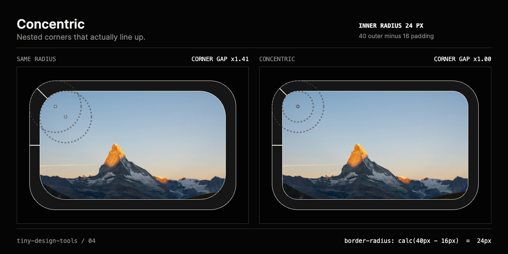

# Concentric

Nested corners that actually line up.

Set the outer radius and the padding. Concentric gives the inner radius, draws the same nested boxes twice, once with the inner box reusing the outer radius and once concentric, and measures the gap at the corner against the gap on the side. It exports the CSS and a 1280 × 640 PNG of the comparison. The innermost box holds a photograph, because a card with a picture inside is the real-world case.

The interface follows the repository's black-and-white instrument system.



## Product frame

- **Audience:** product and interface designers, and frontend developers building cards, inputs, image frames, and anything with a border and a child.
- **Repeated friction:** a rounded box inside a rounded box looks slightly wrong when both use the same radius, and the usual fix is to subtract the padding by hand and hope. The rule is simple, but it is easy to forget and hard to see.
- **Input:** two numbers, an outer radius (0 to 100 px) and a padding (0 to 40 px), plus two or three nesting levels. Type a value, drag a slider, or use the arrow keys.
- **Interaction:** the preview, the inner radius, and the CSS update as you move. The settings are kept in the URL hash, so copying the address shares exactly what you see.
- **Proof:** both versions side by side with the arc centres exposed, the gap measured at the corner and on the side, and a 1280 × 640 PNG.
- **Explicit exclusions:** continuous or "squircle" corners, per-corner radii, elliptical corners, uploads, accounts, analytics, and saved history.
- **Success criterion:** a designer can set their card's radius and padding, see why the inner radius has to be smaller, copy CSS that keeps the two linked, and export a frame that makes the case in a review.

## The rule

For a box inside a box, the inner radius is the outer radius minus the padding between them, and never below zero:

```
inner = max(0, outer − padding)
```

Then both corners are arcs of circles that share one centre, which is what the dashed circles show. The gap between the edges is the same all the way round.

If the inner box keeps the outer radius, the centres are `padding` apart along the diagonal. The gap at the corner then comes out √2 ≈ 1.41 times the gap on the side: the corner looks heavy.

When the padding is larger than the radius, the inner corner is square and the corner gap cannot be fully even. Concentric says so instead of pretending.

## The CSS

```css
.card {
  --radius: 28px;
  --pad: 12px;
  border-radius: var(--radius);
  padding: var(--pad);
}
.card > .inner {
  border-radius: calc(var(--radius) - var(--pad)); /* 16px */
}
```

Custom properties keep the relationship intact when either number changes. A negative `calc()` result for `border-radius` computes to `0px` (checked in a Chromium-based browser). A third level uses `calc(var(--radius) - 2 * var(--pad))`.

## Use it locally

```sh
pnpm install
pnpm dev
```

Open `http://127.0.0.1:5173/concentric/`, or start from a link such as `/concentric/#r=36&p=14&l=3`.

## Validation evidence

`pnpm check` runs thirteen tests for this tool. They check the radii at each level, the box geometry and its clamping, the corner-gap formula for same-radius, concentric, and padding-larger-than-radius cases, that the probe lines drawn in the preview have exactly the lengths the formula predicts, that the arc centres meet only when the corners are concentric, the CSS output, and the URL hash round trip, including a hostile hash.

The browser pass covers typing, the sliders by keyboard, clamping at the maximum, the three-level rule, the padding-larger-than-radius note, a shared link, a hash changed in the same tab, copying, and the export, which is exactly 1280 × 640. Desktop (1440 × 1000) and phone (390 × 844) layouts have no horizontal overflow and 44 px touch targets.

## Honest limitations

- Corners are treated as circular arcs. Continuous corners (as on iOS) use a different curve, and the rule is only approximate for them.
- One radius for all four corners.
- The preview box is fixed at 320 × 200. Radii and padding are real pixel values, but the box is not your component, so a very large radius is limited to half the short side, as CSS does.
- The corner gap is measured along the diagonal between the first two boxes.

## v0.2 candidates

- Drag handles on the preview corner and edge, instead of only sliders.
- Percentage and `rem` output.
- A pasted component size, so the preview matches the real box.

## Privacy and license

Nothing is sent anywhere. The settings live in your address bar only. Concentric is MIT-licensed. The photograph inside the preview card is by Nadine Marfurt, from Unsplash, under the Unsplash License, and is credited in [CREDITS.md](../../CREDITS.md).
