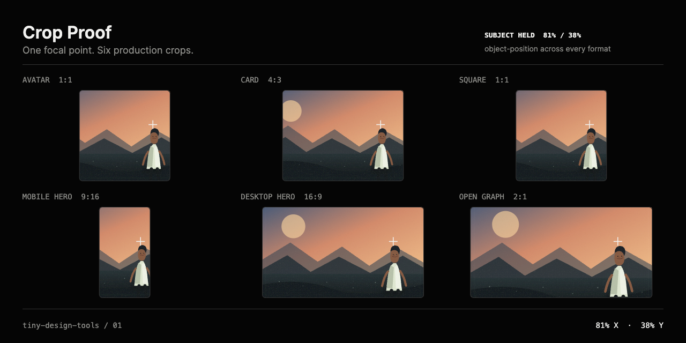

# Crop Proof

Find one focal point that survives every useful crop.

Crop Proof takes one local image, lets a designer drag a linked crosshair, and previews that position across avatar, card, square, mobile hero, desktop hero, and Open Graph formats. It exports a 1280 × 640 PNG crop sheet plus the matching CSS `object-position` value.

The interface follows the repository's black-and-white instrument system. UI chrome is monochrome; the source image remains in its original colour so the tool never alters the designer's work.



## Product frame

- **Audience:** brand, web, and marketing designers, art directors, content teams, and frontend developers.
- **Repeated friction:** the same photograph is corrected separately for every responsive format, which makes subject loss easy to miss.
- **Input:** one local PNG, JPEG, or WebP under 25 MB.
- **Interaction:** drag one linked focal-point crosshair. Arrow keys move it by 1%; Shift plus an arrow moves it by 5%.
- **Proof:** six live production crops, copyable CSS, and a 1280 × 640 PNG crop sheet.
- **Explicit exclusions:** filters, image editing, uploads, accounts, analytics, custom crop building, automatic repair, and subject detection.
- **Success criterion:** a designer can load a real photograph, position its subject once, verify all six crops, copy the CSS, and export the proof without a network request.

## Three-frame storyboard

| 01 / Input | 02 / Manipulation | 03 / Proof |
|---|---|---|
| Load one real photograph | Drag one linked focal point | Export six repaired crops and CSS |

The prepared [9-second capture](../../release/crop-proof-capture.mp4) shows this exact sequence using the original synthetic fixture.

## Use it locally

```sh
pnpm install
pnpm dev
```

Open `http://127.0.0.1:5173/crop-proof/`, choose an image or use the synthetic demo, then drag the crosshair onto the detail that must remain visible.

The generated CSS is compatible with an image using `object-fit: cover`:

```css
img {
  object-fit: cover;
  object-position: 81% 38%;
}
```

## Validation evidence

`pnpm check` passes:

- ESLint;
- three crop-math and failure tests;
- strict TypeScript;
- a production Vite build with a gallery page and static Crop Proof deep link.

The representative tests cover the normal editorial fixture, the 4096 × 192 hostile panorama, zero or corrupted dimensions, out-of-range focal values, and invalid or empty local files.

The browser pass covers:

- local file selection and synthetic demo loading;
- pointer dragging and keyboard movement;
- successful PNG download at exactly 1280 × 640;
- desktop rendering at 1440 × 1000;
- narrow rendering at 390 × 844 without horizontal overflow;
- visible focus treatment, high-contrast diagnostic colours, and reduced-motion preference;
- the hostile panorama and invalid-file error state.

Full results are recorded in [release/RELEASE-NOTES.md](../../release/RELEASE-NOTES.md).

## Honest limitation

The tool preserves one point, not the full bounds of a face, product, or object. A large subject can still be clipped even when its focal point remains visible.

## v0.2 candidates

- an optional subject-safe radius around the focal point;
- a zoomed source loupe for extremely wide or tall images;
- saved custom preset packs after the fixed workflow is validated.

## Privacy and license

The image stays in the browser. There is no upload, telemetry, storage, account, or remote API. Crop Proof and its original synthetic fixtures are MIT-licensed.
