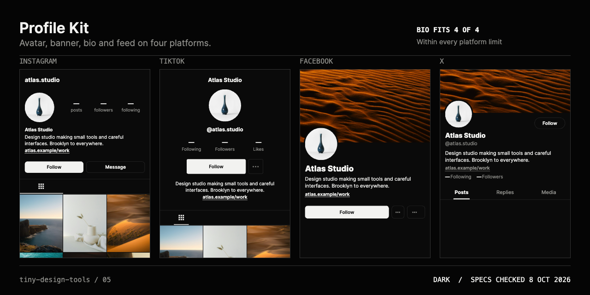

# Profile Kit

See your profile on four platforms before you post.

Add an avatar, a banner, a name, a bio, a link and a set of posts. Profile Kit draws the profile as it would appear on Instagram, TikTok, Facebook and X, checks the bio against each platform's limit, lets you arrange the feed that Instagram and TikTok show under the profile, and exports every avatar and banner at the right size, one mock per platform, and a board of all four.

The interface follows the repository's black-and-white instrument system. The mocks are deliberately generic: monochrome frames that show the real crop and layout, not copies of any platform's interface or branding. Your images keep their original colour.



## Product frame

- **Audience:** designers, brand and social managers, and anyone who sets up the same profile on several platforms.
- **Repeated friction:** each platform wants a different avatar crop, a different banner shape, and a different bio length. The same logo is resized by hand four times, and a banner that works on one platform is cut off on another.
- **Input:** one avatar and one banner (PNG, JPEG or WebP under 25 MB each), a name, handle, bio and link, and up to 24 posts for the feed. Choose files, drop them on a slot, or drop or paste anywhere: the avatar fills first, then the banner, then the feed.
- **Interaction:** click or drag on the avatar, banner or a post to move its crop window, zoom with the slider, and use the arrow keys (1%, or 5% with Shift) for fine moves. Drag posts to reorder the feed, or select one and use EARLIER and LATER. Switch between all four platforms or one at a time, and between a dark and a light screen.
- **Proof:** the mock profiles with the feed in place, a bio counter for every platform at once, and a 1280 × 640 board.
- **Explicit exclusions:** posting or scheduling to any platform, a content calendar, accounts, analytics, uploads, and any attempt to look like a platform's real interface.
- **Success criterion:** a designer can load one logo, one banner and a handful of posts, see them on four platforms, fix what is cropped or too long, settle the order of the grid, and export the files without opening an image editor.

## What each platform shows

| Platform | Banner | Profile content | Posts grid |
|---|---|---|---|
| Instagram | none | avatar, name, bio, link | yes, 3:4 tiles |
| TikTok | none | avatar, name, bio, link | yes, 3:4 tiles |
| Facebook | cover | avatar, name, bio, link | no |
| X | header | avatar, name, bio, link | no |

The banner pad shows one image with three outlines on it: the X header, the Facebook cover on desktop, and the Facebook cover on a phone. They share one crop, so a single move shows where all three land. When the primary frame already fills the image, the pointer drives the next frame that has room to slide.

## The feed

Instagram and TikTok show posts in a grid under the profile, so the feed only appears on those two mocks. Facebook and X show a profile section only.

- **Order:** the first tile is the newest post, as on the platforms. Drag tiles to reorder them, or select one and use EARLIER and LATER, which work from the keyboard and on a touch screen.
- **Cropping:** every post is cut to a 3:4 tile. Select a post to see its window on the full image and move or zoom it. A second outline shows a centred square, because TikTok's grid crop is reported as either 3:4 or a square; keep the subject inside it to be safe under both.
- **One feed for both platforms:** the same posts and the same crops are drawn on Instagram and TikTok, which is how cross-posted content behaves.
- **Limit:** the feed holds 24 posts. Extra images are left out and the tool says how many.

If an image in a batch cannot be read, the others are still added, and a single message says what was skipped and why.

## Kept in this browser

The profile, including every image, is kept in this browser's own storage (IndexedDB) so a refresh does not lose your arrangement. A status line shows SAVING, then KEPT IN THIS BROWSER, or says so if the browser refuses to store it (a full disk, or a private window). It never leaves the device, and **CLEAR** removes it. The page also saves when the tab is hidden.

## The specs, and how far to trust them

Every number the tool uses is listed under **SPECS** in the tool, with a confidence label and the date last checked (8 October 2026):

- **Official:** published by the platform. Only X's header, photo and bio figures were readable on the platform's own help pages.
- **Reported:** figures independent guides agree on. The platforms' own help pages for Instagram, TikTok and Facebook could not be read when this was checked.
- **Disputed:** guides disagree. TikTok's bio limit is 80 characters or 160, depending on the source, and its grid crop is described as either 3:4 or a centred square. The tool counts TikTok against 80 and says so.

Platforms change these without notice. Treat the tool as a way to see how a profile reads, and confirm a hard limit in the app.

## Export

- **Board PNG:** all four profiles side by side at 1280 × 640, with a finding in the header such as "BIO FITS 3 OF 4".
- **Mock PNG:** one platform at 780 × 1688, a phone screenshot at twice the logical size.
- **All files (ZIP):** the board, one mock per platform, and each avatar and banner at its size. Avatar and banner files can be PNG or JPEG (JPEG keeps photographic banners small; X limits profile photos to 2 MB).

| File | Size |
|---|---|
| `instagram-avatar-640x640` | 640 × 640 |
| `tiktok-avatar-400x400` | 400 × 400 |
| `facebook-avatar-640x640` | 640 × 640 |
| `x-avatar-400x400` | 400 × 400 (X's recommended size) |
| `x-header-1500x500` | 1500 × 500 (X's recommended size) |
| `facebook-cover-1702x630` | 1702 × 630 (twice the 851 × 315 upload size guides recommend) |

Avatars are exported as squares. Each platform applies its own circle.

## Use it locally

```sh
pnpm install
pnpm dev
```

Open `http://127.0.0.1:5173/profile-kit/`. A first visit opens on a demo profile, so the page is never an empty form. The demo is not saved unless you change it, and **LOAD DEMO** brings it back.

## Validation evidence

`pnpm check` runs twenty-two tests for this tool and three for the ZIP writer it shares. They cover the crop window (shape, zoom, hostile values, and following a pointer), the per-axis choice of which frame drives the pointer, text wrapping and truncation, character counting, bio limits across platforms, which platforms have a banner or a grid, that every spec carries a confidence label, and the feed: reordering, removal, the 24-post cap, and that the selection follows its post through every possible move. The ZIP writer is checked against an independent reader and the standard CRC-32 value.

The browser pass covers: the bio counters at 80, 120 and 161 characters; name and handle limits; clicking, dragging and keyboard moves on the banner pad; zoom; every platform tab and both themes; paste, drop and file input; a rejected PDF and a corrupt PNG; the feed (selecting, EARLIER and LATER, dragging a tile onto another, removing, adding a batch that includes a corrupt file, the 24-post cap, and where pasted images go); a refresh restoring the order, text, theme, format, avatar and banner; CLEAR leaving nothing behind; and the exports. A real exported archive was checked with the system `unzip`, every file's pixel size was read from its header, JPEG files were confirmed as JPEG, and the board and mocks were opened and inspected. Desktop (1440 × 1000) and phone (390 × 844) layouts have no horizontal overflow and 44 px touch targets.

## Honest limitations

- The mocks approximate each platform's layout. They are for judging crops, bio length and overall feel, not for pixel-exact previews.
- Counts of followers and posts are shown as dashes rather than invented numbers.
- Emoji and some characters may count differently on a platform than they do here.
- The platform specs are a snapshot. See above.
- One avatar and one banner are shared by every platform, and one feed by Instagram and TikTok.

## Privacy and license

Images and text are decoded and drawn in the browser. Nothing is uploaded. Your profile is kept in this browser's own storage once you change something, so a refresh does not lose it, and CLEAR removes it. The untouched demo is never stored. Profile Kit is MIT-licensed. The demo photographs are from Unsplash, are not MIT-licensed, and are credited in [CREDITS.md](../../CREDITS.md).
