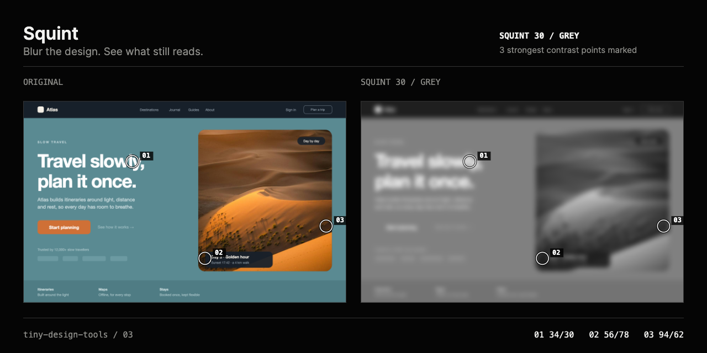

# Squint

Blur the design. See what still reads.

Squint takes one screenshot, blurs it to the strength you choose, and shows the result beside the original. Numbered rings mark where light-against-dark contrast survives the blur. It exports a 1280 × 640 PNG proof with both versions side by side.

The interface follows the repository's black-and-white instrument system. The screenshot keeps its original colour in the original panel; colour is only removed in the squinted panel, because removing it is the tool's function.



## Product frame

- **Audience:** product and brand designers, art directors, design reviewers, and frontend developers.
- **Repeated friction:** a hierarchy that looks clear at full size can fall apart at a glance. The usual check is to squint at the screen, which is subjective and cannot be shared.
- **Input:** one local PNG, JPEG, or WebP under 25 MB. Choose a file, drop one on the page, or paste from the clipboard.
- **Interaction:** one strength slider (0 to 100), a tone choice (colour, grey, or three tones), and a switch for the contrast rings. The slider takes arrow keys, Home, and End.
- **Proof:** original and squinted views side by side, up to three ranked contrast points with coordinates, and a 1280 × 640 PNG.
- **Explicit exclusions:** attention prediction, accessibility scoring, automatic redesign, uploads, accounts, analytics, and saved history.
- **Success criterion:** a designer can drop a real screenshot, raise the blur until something important disappears, and export a frame that shows a reviewer exactly what vanished.

## Three-frame storyboard

| 01 / Input | 02 / Manipulation | 03 / Proof |
|---|---|---|
| Drop a screenshot | Raise the blur and switch to grey | Export original and squint side by side |

The built-in demo is a travel landing page, with a photograph in its hero, whose call to action has the same luminance as the field behind it. In colour the button is the loudest thing on the page. In grey it disappears, while the headline and the photograph hold.

## How it works

- The image is decoded once into a working copy no larger than 1200 px on its longest edge, flattened onto white so transparent areas read as paper. Strength is a percentage of that edge, so one setting looks the same at any resolution.
- The blur is three box passes per channel, sized to approximate a Gaussian. The effective blur is within 2% of the ideal Gaussian at the default strength and within 6% from about 3 px upward; finer blurs are coarser but visually indistinguishable.
- **Contrast points** compare the blurred image with a much softer copy of itself (a centre-surround difference), average the result over a coarse grid, and take the strongest areas, keeping them at least a fifth of the image width apart. A point is only reported if its contrast clears a small floor, so a flat image reports none.
- **Three tones** splits the image into equally populated shadow, midtone, and light bands, which makes grouping visible.

## Use it locally

```sh
pnpm install
pnpm dev
```

Open `http://127.0.0.1:5173/squint/`.

## Validation evidence

`pnpm check` runs eleven tests for this tool. They check the blur against analytic properties (a flat field stays flat, a single bright pixel keeps its total light, box widths approximate the requested Gaussian), tone banding, the working-size cap, and contrast-point placement for one shape, two shapes, and a flat image.

The browser pass covers file, drop, and paste input; a PDF and a corrupt PNG; the slider by keyboard; all three tones; showing and hiding the rings; and the export, which is exactly 1280 × 640. Desktop (1440 × 1000) and phone (390 × 844) layouts have no horizontal overflow and 44 px touch targets.

## Honest limitations

- Contrast points show where light-against-dark contrast survives. They are not a model of where a person looks, and they ignore meaning, faces, and motion.
- Contrast is measured on gamma-encoded luminance, which matches how a browser blurs a screenshot but is not a perceptual model.
- Very large images are scaled down to the working size before blurring.

## v0.2 candidates

- A before and after wipe in a single panel.
- A region probe: drag a box over a call to action and report its contrast against its surroundings at the current blur.
- Colour-vision simulations alongside the blur.

## Privacy and license

The image stays in the browser. There is no upload, telemetry, storage, account, or remote API. Squint and the layout of its demo page are MIT-licensed. The photograph in the demo page is by Benoît Deschasaux, from Unsplash, under the Unsplash License, and is credited in [CREDITS.md](../../CREDITS.md).
